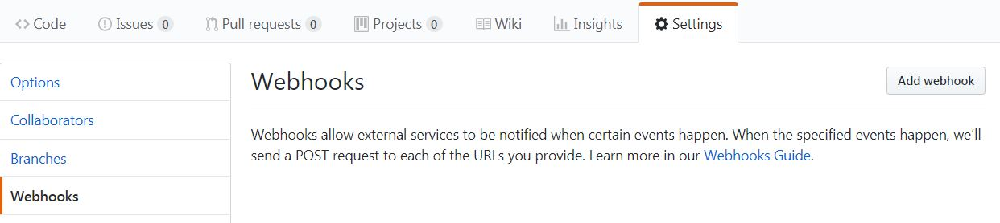
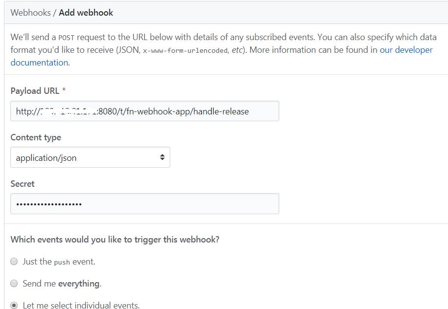
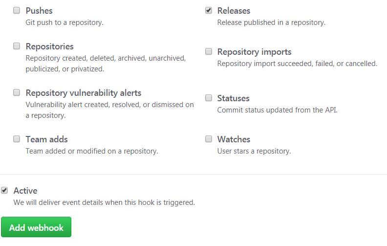
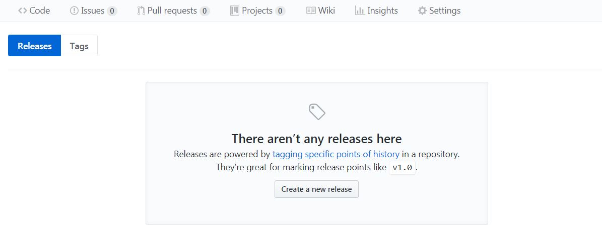
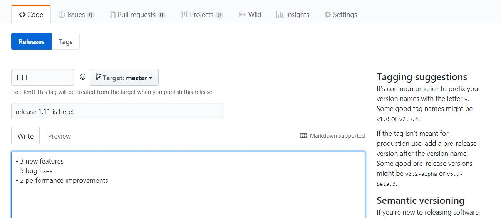
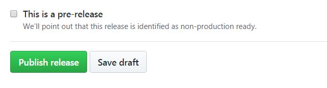

*"Webhooks allow you to build or set up GitHub Apps which subscribe to certain events on GitHub.com. When one of those events is triggered, we'll send a HTTP POST payload to the webhook's configured URL"*

This is a [Fn](https://github.com/fnproject/cli) function (written in **Go**) which acts as a GitHub webhook. Once configured and deployed

- it will be invoked in response to a new release in a GitHub repo 
- and post release details (repo, version and access link) to Twitter

## To start with...

You will need

- [Twitter](https://twitter.com/) account
- [GitHub](https://github.com/) account

> Make sure you have **Fn** installed on an infra which can be accessed from public internet (e.g. VM), or use [ngrok](https://ngrok.com/) on your local machine to set up a secure tunnel to your localhost i.e. provide access to your local Fn server from the Internet

### Twitter app setup

Follow [these instructions](https://apps.twitter.com/). You'll need `Consumer Key` (API Key), `Consumer Secret` (API Secret), `Access Token` and `Access Token Secret` for your function

### GitHub setup

Feel free to use an existing GitHub repository if you have one. I would recommend setting up a dummy repo to test things out

## Deploy the function

- get latest and greatest **Fn**
    - [Fn CLI](https://github.com/fnproject/cli) - `curl -LSs https://raw.githubusercontent.com/fnproject/cli/master/install | sh`
    - Fn server - `fn update server`
- start Fn server - `fn start`
- clone this repo
- `cd fn-github-webhook-twitter`
- create the app - `fn create app --config twitter_consumerkey=<twitter_consumerkey> --config twitter_consumersecret=<twitter_consumersecret> --config twitter_accesstoken=<twitter_accesstoken> --config twitter_accesstokensecret=<twitter_accesstokensecret> --config github_webhook_secret=<github_webhook_secret> fn-webhook-app` 

e.g. `fn create app --config twitter_consumerkey=foo --config twitter_consumersecret=bar --config twitter_accesstoken=red-me --config twitter_accesstokensecret=s3cr3t --config github_webhook_secret=kehsihba fn-webhook-app`

> value for `github_webhook_secret` is used as the `Secret` for GitHub webhook configuration in next step (section)

- deploy the function - `fn -v deploy --app fn-webhook-app --local`

You should see an output similar to below..

    ```
    ...
    Updating function github-release-handler using image github-release-handler:0.0.2...
    Successfully created app:  fn-webhook-app
    Successfully created function: github-release-handler with github-release-handler:0.0.2
    Successfully created trigger: handle-release
    Trigger Endpoint: http://localhost:8080/t/fn-webhook-app/handle-release
    ```

## Configure GitHub webhook

Go to `Settings > Webhooks` section of your repository to get started - details in [Github docs](https://developer.github.com/webhooks/creating/#setting-up-a-webhook) and start by clicking `Add Webhook`



- for the Payload URL section, enter the Fn function trigger endpoint e.g. `http://<your_fn_server_IP>:8080/t/fn-webhook-app/handle-release`
- choose `application/json` as content type
- enter a `Secret` - use the value which you used for `github_webhook_secret` while creating the function (`fn create...`)



- for `Events`, check `Let me select individual events` and (scroll down) check `Releases`... ensure `Active` checkbox is checked and click `Add webhook`



## Test

### Create a release

- go to `https://github.com/<user>/<repo>/releases`
- click `Create a new release`



- fill details



- Click `Publish release`



### Check twitter

You should see the tweet


### Check GitHub

Under repo `Settings > Webhooks`, search the one you configured and see the `Recent Deliveries` section. You'll see a `HTTP 200` (from Fn function) along with the tweet text


### Problems
In case there is an issue with Twitter creds, tweets won't get posted. This will result in `HTTP 500` from Fn function


