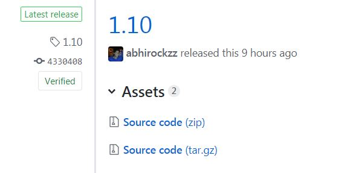
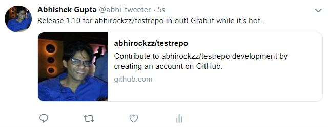
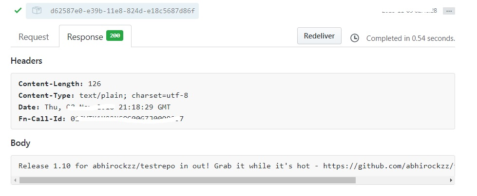

*"Webhooks allow you to build or set up GitHub Apps which subscribe to certain events on GitHub.com. When one of those events is triggered, we'll send a HTTP POST payload to the webhook's configured URL"*

This is a [Fn](https://github.com/fnproject/cli) function (written in **Go**) which acts as a GitHub webhook. Once configured and deployed

- it will be invoked in response to a new release in a GitHub repo 

- and post release details (repo, version and access link) to Twitter

> the function in this example is configured to respond to GitHub releases, but the same can be extended/applied to other events such as pull requests, commits etc.

## To start with...

You will need

- [Twitter](https://twitter.com/) account
- [GitHub](https://github.com/) account

### Twitter app setup

Follow [these instructions](https://apps.twitter.com/). You'll need `Consumer Key` (API Key), `Consumer Secret` (API Secret), `Access Token` and `Access Token Secret` for your function

### GitHub setup

Feel free to use an existing GitHub repository if you have one. I would recommend setting up a dummy repo to test things out

## Deploy the function

- get latest and greatest **Fn**
    - [Fn CLI](https://github.com/fnproject/cli) - `curl -LSs https://raw.githubusercontent.com/fnproject/cli/master/install | sh`
    - Fn server - `fn update server`

> Make sure you have **Fn** installed on a machine which can be accessed from public Internet (e.g. a VM), or use [ngrok](https://ngrok.com/) on your local machine to set up a secure tunnel to your `localhost`

- start Fn server - `fn start`
- clone this repo
- `cd fn-github-webhook-twitter`
- create the app - `fn create app --config twitter_consumerkey=<twitter_consumerkey> --config twitter_consumersecret=<twitter_consumersecret> --config twitter_accesstoken=<twitter_accesstoken> --config twitter_accesstokensecret=<twitter_accesstokensecret> --config github_webhook_secret=<github_webhook_secret> fn-webhook-app` 

e.g. `fn create app --config twitter_consumerkey=foo --config twitter_consumersecret=bar --config twitter_accesstoken=red-me --config twitter_accesstokensecret=s3cr3t --config github_webhook_secret=kehsihba fn-webhook-app`

> value for `github_webhook_secret` is used as the `Secret` for GitHub webhook configuration in next step (section)

- deploy the function - `fn -v deploy --app fn-webhook-app --local`

You should see an output similar to below..

    ...
    Updating function github-release-handler using image github-release-handler:0.0.2...
    Successfully created app:  fn-webhook-app
    Successfully created function: github-release-handler with github-release-handler:0.0.2
    Successfully created trigger: handle-release
    Trigger Endpoint: http://localhost:8080/t/fn-webhook-app/handle-release

> note down the `Trigger Endpoint`

## Configure GitHub webhook

You can use the UI `Settings > Webhooks` section of your repository to get started - details in [Github docs](https://developer.github.com/)

We'll use the [GitHub REST API](https://developer.github.com/v3/repos/hooks/#create-a-hook) for now

> I used OAauth token over Basic Authentication via REST API. You can read up on this and more [over here](https://developer.github.com/v3/auth/)

Here is en example cURL command with the payload

	curl -X POST -u <github_user_id>:<your_github_token_or_password> \
	  https://api.github.com/repos/<github_user>/<github_repo>/hooks \
	  -H 'content-type: application/json' \
	  -d '{
	  "name": "web",
	  "active": true,
	  "events": [
	    "release"
	  ],
	  "config": {
	    "url": "<fn_function_endpoint>",
	    "secret": "<your_github_webhook_secret>",
	    "content_type": "json",
	    "insecure_ssl": 1
	  }
	}'

Replace the following parameters as per your setup

- `github_user_id` - user ID
- `your_github_token_or_password` - OAuth token or password
- `github_user` - user name
- `github_repo` - repository for which webhook is being configured
- `your_github_webhook_secret` - use the value which you used for `github_webhook_secret` while creating the function (`fn create...`)
- `fn_function_endpoint` - enter the Fn function trigger endpoint e.g. `http://<your_fn_server_IP>:8080/t/fn-webhook-app/handle-release`

Once completed, the new webhook should show up in the UI `Settings > Webhooks` section

## Test

### Create a release

We'll use [the REST API](https://developer.github.com/v3/repos/releases/#create-a-release)

	curl -X POST -u <github_user_id>:<your_github_token_or_password> \
	  https://api.github.com/repos/<github_user>/<github_repo>/releases \
	  -H 'content-type: application/json' \
	  -d '{
	  "tag_name": "v1.0.0",
	  "target_commitish": "master",
	  "name": "v1.0.0",
	  "body": "Description of the release",
	  "draft": false,
	  "prerelease": false
	}'

You should see the new release in the UI under `https://github.com/<user>/<repo>/releases` 

### Check twitter

You should see the tweet

### Check GitHub

Under repo `Settings > Webhooks`, search the one you configured and see the `Recent Deliveries` section. You'll see a `HTTP 200` (from Fn function) along with the tweet text

### Problems
In case there is an issue with Twitter creds, tweets won't get posted. This will result in `HTTP 500` from Fn function

